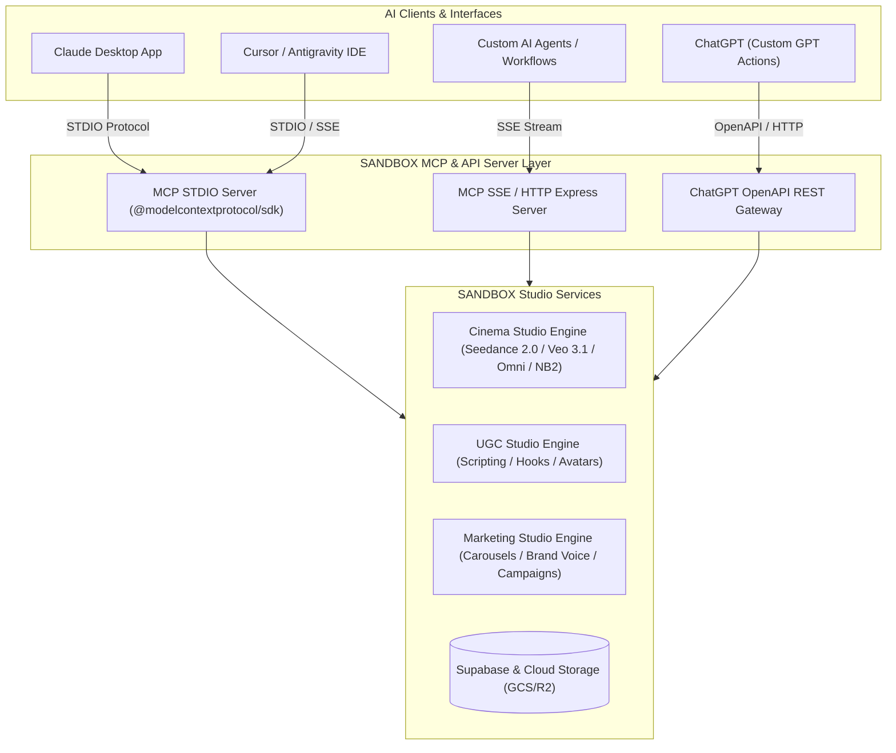

# 🚀 Model Context Protocol (MCP) Server Architecture & Integration Plan
## For UGC Studio, Cinema Studio & Marketing Studio (Claude, ChatGPT & Agent Workflows)

---

## 1. Executive Summary & Overview

The **Model Context Protocol (MCP)** is an open standard created by Anthropic that allows AI models (such as Claude Desktop, Cursor, Antigravity, and custom AI agents) to securely discover and invoke real-time tools, read context resources, and access prompt templates.

By building an **MCP Server** for your platform (**SANDBOX AI STUDIO**), users and AI assistants can autonomously trigger high-level creative tasks directly through natural language from Claude, Cursor, or ChatGPT.

### Dual-Integration Architecture



---

## 2. Directory & Project Structure

The MCP server module is organized within the backend under `server/mcp/` so it seamlessly reuses existing database queries, Cloud storage helpers, and route services.

```
SANDBOX-AI-STUDIO/
├── docs/
│   └── MCP_SERVER_ARCHITECTURE.md # Architecture & integration reference
├── server/
│   ├── mcp/
│   │   ├── index.js               # MCP STDIO Entrypoint
│   │   ├── mcpServer.js           # Core MCP Server initialization & Tool Registrar
│   │   ├── openapiSpec.js         # OpenAPI Spec generator for ChatGPT Custom GPTs
│   │   └── tools/
│   │       ├── cinemaTools.js     # Cinema Studio Tools (Seedance, Veo, Omni, NB2)
│   │       ├── ugcTools.js        # UGC Studio Tools (Ad Scripts, Hooks, Avatar Video)
│   │       └── marketingTools.js  # Marketing Studio Tools (Carousels, Voice, Campaigns)
│   ├── routes/
│   │   └── mcpRoutes.js           # Express SSE stream and OpenAPI spec endpoints
│   └── server.js                  # Main Express Server
```

---

## 3. Exposed MCP Tools Specification

### A. 🎬 Cinema Studio Tools (`cinemaTools.js`)

- **`cinema_generate_video`**: Generate cinematic AI videos using Seedance 2.0 (`seedace`), Seedance Fast (`seedance-fast`), Veo 3.1 (`veo-3.1-lite-generate-preview`), or Omni Flash (`omni-flash`).
  - Inputs: `prompt` (string), `engine` (enum), `aspectRatio` (`16:9`, `9:16`, `1:1`), `resolution` (`480p`, `720p`, `1080p`), `duration` (number), `userId` (string).
- **`cinema_generate_image`**: Generate high-fidelity AI images using Nano Banana 2 (`nano-banana-2`, `nano-banana-pro`) or GPT Image Pro (`gpt-image-2`).
  - Inputs: `prompt` (string), `engine` (enum), `aspectRatio` (`16:9`, `9:16`, `1:1`), `style` (string).
- **`cinema_get_task_status`**: Query asynchronous rendering status for video generation tasks.
  - Inputs: `taskId` (string), `engine` (string).
- **`cinema_list_user_assets`**: Query user asset gallery history across projects.
  - Inputs: `userId` (string), `limit` (number).

### B. 📱 UGC Studio Tools (`ugcTools.js`)

- **`ugc_generate_ad_script`**: Generate high-converting UGC script with hook, body, and CTA.
  - Inputs: `productName` (string), `productUrl` (string), `targetAudience` (string), `platform` (`tiktok`, `reels`, `shorts`).
- **`ugc_generate_hook_variations`**: Generate 5 viral visual/verbal hook variations for a product.
  - Inputs: `productDescription` (string), `niche` (string).
- **`ugc_create_avatar_video`**: Render AI spokesperson avatar video clip from a script.
  - Inputs: `scriptText` (string), `avatarId` (string), `voiceId` (string), `aspectRatio` (`9:16`, `16:9`).

### C. 📊 Marketing Studio Tools (`marketingTools.js`)

- **`marketing_generate_carousel`**: Generate multi-slide Instagram/LinkedIn carousel card copy & layout directives.
  - Inputs: `topic` (string), `slideCount` (number), `brandTone` (string).
- **`marketing_clone_brand_voice`**: Create reusable brand voice profile (`yourVoice`) from brand samples.
  - Inputs: `sampleText` (string), `brandName` (string).
- **`marketing_create_full_campaign`**: Generate multi-channel launch campaign kit (ad copy, prompts, captions).
  - Inputs: `productLaunchDetails` (string).

---

## 4. Connecting AI Assistants

### A. Claude Desktop & Cursor Integration (`claude_desktop_config.json`)

To connect Claude Desktop to your local SANDBOX Studio MCP server:

Add the following configuration block to `%APPDATA%\Claude\claude_desktop_config.json` (Windows) or `~/Library/Application Support/Claude/claude_desktop_config.json` (Mac):

```json
{
  "mcpServers": {
    "sandbox-ai-studio": {
      "command": "node",
      "args": [
        "C:/Users/Hemanth/Documents/zerolens/SANDBOX-AI-STUDIO/server/mcp/index.js"
      ],
      "env": {
        "API_BASE_URL": "http://localhost:5000"
      }
    }
  }
}
```

### B. ChatGPT Custom GPT Actions (OpenAPI Endpoint)

ChatGPT supports HTTP REST Actions via OpenAPI specs. Access `/api/mcp/openapi.json` on your server to import your studio capabilities directly into a Custom GPT!

---

## 5. Maintenance & Expansion Guidelines

1. **Adding New Tools**:
   To add a new tool, define its schema in the appropriate `server/mcp/tools/*.js` file and register its handler in `handleToolCall`.
2. **Authentication & Rate Limiting**:
   Tools accept `userId` or authenticate via Bearer token when running over HTTP/SSE.
3. **Async Polling**:
   Long-running tasks (like Seedance 2.0 1080p renders) return a `taskId` and polling instructions so AI agents like Claude can wait for completion before replying to the user.
