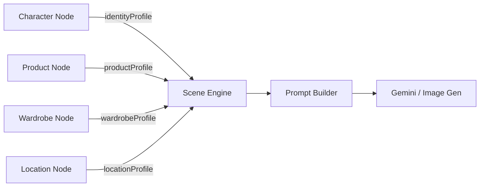

# 🧠 Node Architecture — Structured Profile System

> **Every data-source node outputs a structured profile object with an intelligence layer.**
> Auto Story Mode, Prompt Builder, and Scene Context Builder all read these profiles directly.

---

## 📐 Architecture Overview

```
Upload → Vision API → Intelligence Layer → Structured Profile → Scene Engine
```

All four data-source nodes follow the same pattern:

| Node | Profile Key | Intelligence Function | Color |
|---|---|---|---|
| **Character** | `identityProfile` | *(built in store)* | `#bef264` lime |
| **Product** | `productProfile` | `enrichProductProfile()` | `#f59e0b` amber |
| **Wardrobe** | `wardrobeProfile` | `buildWardrobeProfile()` | `#f43f5e` rose |
| **Location** | `locationProfile` | `buildLocationProfile()` | `#22d3ee` cyan |



---

## 1. 🧑 Character Node (`InfluencerNode.jsx`)

**Type**: `influencer`
**Purpose**: Identity data source — anchors, poses, expression lock.

### Data Structure

```js
data: {
  label: "Model_01",
  identityProfile: {
    identityLock: true,
    anchors: {
      side: "https://...",    // Side profile anchor image
      full: "https://..."     // Full body anchor image
    },
    poses: [
      "editorial full body",
      "side profile",
      "walking motion",
      "over shoulder",
      "hero stance",
      "relaxed pose"
    ],
    defaultExpression: "confident"
  }
}
```

### Safe Defaults

```js
const identity = data?.identityProfile;
identity?.anchors?.side    // never crashes
identity?.poses?.length    // returns 0 if missing
```

### What Auto Story Reads

| Field | Purpose |
|---|---|
| `identityLock` | If `true`, enforce same face across all shots |
| `anchors.side` | Reference for profile shots |
| `anchors.full` | Reference for full body shots |
| `poses` | Available pose library for shot variation |
| `defaultExpression` | Fallback expression for all shots |

### Visual Output

- Shows side + full body anchor images
- Pose count badge: `"6 Poses Stored"`
- Lock status indicator: `LOCKED` / `OPEN`

---

## 2. 📦 Product Node (`ProductNode.jsx`)

**Type**: `product`
**Purpose**: Product data source — vision analysis + cinematic shot flags.

### Intelligence Function

```js
const enrichProductProfile = (labels = []) => {
  // Keywords that trigger macro close-up shots
  const macroKeywords = ["watch", "jewelry", "ring", "bracelet", "necklace", "texture"];
  // Keywords that trigger center hero composition
  const heroKeywords = ["bottle", "box", "electronics", "phone", "laptop", "device"];
  // Keywords that trigger clean minimal background
  const cleanKeywords = ["cosmetic", "makeup", "skincare", "perfume"];

  return {
    macroRequired,        // → add macro detail shots
    heroRequired,         // → add center hero composition
    cleanBackgroundPreferred  // → enforce studio lighting
  };
};
```

### Data Structure

```js
data: {
  productProfile: {
    image: "data:image/...",
    name: "product.jpg",
    description: "Premium leather watch with...",
    labels: ["watch", "leather", "luxury"],
    colors: ["#2C1810", "#D4A574"],
    macroRequired: true,
    heroRequired: true,
    cleanBackgroundPreferred: false,
    scale: "MICRO",
    isMicro: true,
    isHandheld: false,
    isLarge: false,
    consistencyLock: true
  },
  status: "READY"   // IDLE | ANALYZING | READY
}
```

### What Auto Story Reads

| Flag | Trigger | Shot Impact |
|---|---|---|
| `macroRequired` | watch, jewelry, ring... | Add macro detail + extreme close-up |
| `heroRequired` | bottle, box, electronics... | Center composition, label visibility |
| `cleanBackgroundPreferred` | cosmetic, skincare... | Minimal studio, soft diffused light |
| `scale` | `MICRO` (ring, earring) / `HANDHELD` (watch, phone) / `LARGE` (car, furniture) | Prevents wide shots of tiny objects |
| `labels` | Vision API output | Tag-based prompt enrichment |
| `colors` | Vision API output | Color grading hints |

### Visual Output

- Product image preview with `SCANNED` badge
- Vision labels as amber tag pills
- Description text
- Color swatches
- Intelligence badges: `MACRO` `HERO` `CLEAN_BG`

---

## 3. 👗 Wardrobe Node (`WardrobeNode.jsx`)

**Type**: `wardrobe`
**Purpose**: Outfit data source — multi-item wardrobe with texture/macro intelligence.

### Intelligence Function

```js
const buildWardrobeProfile = (items) => {
  const macroCategories = ["watch", "jewelry", "belt", "eyewear"];

  return {
    items,                    // Full item array with prompts
    fullOutfitPrompt,         // Concatenated for backwards compat
    macroFocusItems,          // Categories needing close-ups
    accessoryCount,           // Total items
    textureRich,              // silk/leather/metal detected
    consistencyLock: true
  };
};
```

### Data Structure

```js
data: {
  wardrobeProfile: {
    items: [
      {
        id: "...",
        category: "watch",
        name: "Rolex Submariner",
        wearPrompt: "wearing a brushed steel Rolex...",
        closeUpPrompt: "macro shot of watch dial...",
        focusPriority: "macro"
      }
    ],
    fullOutfitPrompt: "wearing a brushed steel Rolex AND emerald silk gown...",
    macroFocusItems: ["watch"],
    accessoryCount: 2,
    textureRich: true,
    consistencyLock: true
  },
  status: "READY"
}
```

### What Auto Story Reads

| Flag | Trigger | Shot Impact |
|---|---|---|
| `macroFocusItems` | watch, jewelry, belt, eyewear | Add accessory close-up shots |
| `textureRich` | silk, leather, metal, velvet, satin | Add fabric macro shot |
| `accessoryCount` | `> 1` | Multiple accessory shots |
| `consistencyLock` | Always `true` | Same outfit across all shots |
| `fullOutfitPrompt` | Concatenated prompts | Injected into every shot |
| `motionStyle` | `FLOWY` (silk, chiffon, gown) / `RIGID` (leather, denim, suit) / `NEUTRAL` | Motion instruction for AI video (Sora/Runway/Luma) |

### Categories

`eyewear` · `watch` · `belt` · `jacket` · `shoes` · `jewelry` · `bag` · `hat` · `top` · `bottom`

### Visual Output

- Category selector grid (2×5)
- Compact upload area
- Item list with category badges
- Intelligence flags: `TEXTURE` `MACRO` `FLOWY` / `RIGID` `LOCKED`

---

## 4. 📍 Location Node (`LocationNode.jsx`)

**Type**: `location`
**Purpose**: Environment data source — scene analysis with cinematic Director intelligence.

### Intelligence Function

```js
const enrichLocationProfile = (loc) => {
  const cinematicTimes = ["sunset", "night", "golden hour", "sunrise", "dusk", "dawn", "blue hour"];
  const dramaticAtmospheres = ["foggy", "moody", "stormy", "noir", "dark", "neon"];

  return {
    depthType: loc.settingType === "indoor" ? "controlled" : "wide",
    cinematicBoost: cinematicTimes.some(t => timeStr.includes(t)),
    dramaticLighting: dramaticAtmospheres.some(a => atmosStr.includes(a))
  };
};
```

**Director logic:**
- `cinematicBoost` → longer establishing shot, warm grading
- `dramaticLighting` → side-lit portrait, high contrast
- `depthType = "wide"` → 24mm lens, establishing shots
- `depthType = "controlled"` → studio lighting, even exposure

### Data Structure

```js
data: {
  locationProfile: {
    image: "data:image/...",
    name: "Golden Gate Bridge at Sunset",
    settingType: "bridge",
    timeOfDay: "golden hour",
    lighting: "Warm directional sunlight with orange rim lighting",
    atmosphere: "cinematic, epic",
    colorGrade: "warm orange teal",
    establishingPrompt: "Wide aerial shot of Golden Gate Bridge...",
    backgroundPrompt: "Soft bokeh of bridge cables and sunset sky...",
    // Intelligence flags
    depthType: "wide",
    cinematicBoost: true,
    dramaticLighting: false,
    depth: "DEEP",
    hasBackgroundDepth: true,
    isConfined: false,
    moodStrength: "cinematic",
    consistencyLock: true
  },
  status: "READY"
}
```

### What Auto Story Reads

| Flag | Trigger | Shot Impact |
|---|---|---|
| `depthType` | `"wide"` (outdoor) / `"controlled"` (indoor) | Lens choice: 24mm wide vs 50mm studio |
| `cinematicBoost` | sunset, golden hour, night... | Longer establishing shot, warm color grading |
| `dramaticLighting` | foggy, moody, stormy, noir... | Side-lit portrait, high contrast |
| `depth` | `CONFINED` (elevator, closet) / `DEEP` (beach, mountain) / `STANDARD` | Camera movement freedom |
| `moodStrength` | Always `"cinematic"` | Tone baseline for prompt injection |
| `establishingPrompt` | Vision analysis | Wide/establishing shot prompt |
| `backgroundPrompt` | Vision analysis | Close-up bokeh background |
| `consistencyLock` | Always `true` | Same location across all shots |

### Visual Output

- Location image with gradient name overlay + `LOCKED` badge
- Meta tags: time of day, setting type, atmosphere
- Lighting description with sun icon
- Wide Shot prompt block (cyan)
- Bokeh BG prompt block (grey)
- Intelligence flags: `WIDE_24mm` / `STUDIO` · `CINEMATIC` · `DRAMATIC` · `DEEP` / `CONFINED` · `LOCKED`

---

## 🏗 Store Integration (`store.js`)

### Node Creation Functions

```js
// All four follow the same pattern:
addInfluencerNode(position)   // → identityProfile from activeCharacter
addProductNode(position)      // → productProfile: null, status: 'IDLE'
addWardrobeNode(position)     // → wardrobeProfile: null, status: 'IDLE'
addLocationNode(position)     // → locationProfile: null, status: 'IDLE'
```

### Status Lifecycle

```
IDLE → ANALYZING → READY
```

- `IDLE` — Node just created, no data uploaded
- `ANALYZING` — Image uploaded, Vision API in progress
- `READY` — Analysis complete, profile built with intelligence flags

---

## 🎬 How Auto Story Uses Profiles

### Scene Context Building

```js
// Pseudo-code for how the Scene Engine reads node data:
const context = {};

nodes.forEach(node => {
  if (node.type === 'influencer') context.character = node.data.identityProfile;
  if (node.type === 'product')    context.product   = node.data.productProfile;
  if (node.type === 'wardrobe')   context.wardrobe  = node.data.wardrobeProfile;
  if (node.type === 'location')   context.location  = node.data.locationProfile;
});
```

### Intelligent Shot Planning

```js
// Product intelligence
if (context.product?.macroRequired)          → addMacroCloseUpShot()
if (context.product?.heroRequired)           → addCenterHeroShot()
if (context.product?.cleanBackgroundPreferred) → enforceMinimalStudioLighting()

// Product SCALE — prevents wrong camera distance
if (context.product?.isMicro)                → cameraDistance = "Macro Extreme Close-up"
if (context.product?.isLarge)                → cameraDistance = "Wide Establishing Shot"

// Wardrobe intelligence
if (context.wardrobe?.accessoryCount > 1)    → addAccessoryCloseUpShots()
if (context.wardrobe?.textureRich)           → addFabricMacroShot()
if (context.wardrobe?.macroFocusItems.includes('watch')) → addWatchCloseUp()

// Wardrobe MOTION — critical for AI video
if (context.wardrobe?.isFlowy)               → motionPrompt = "fabric catches the wind, elegant flowing movement"
if (context.wardrobe?.isRigid)               → motionPrompt = "structured silhouette, stable and powerful stance"

// Location intelligence
if (context.location?.cinematicBoost)       → longerEstablishingShot(), warmColorGrading()
if (context.location?.dramaticLighting)     → sideLitPortrait(), highContrast()
if (context.location?.depthType === 'wide') → use24mmLens(), naturalLightManagement()
if (context.location?.depthType === 'controlled') → studioLighting(), evenExposure()

// Location DEPTH — camera movement freedom
if (context.location?.isConfined)           → cameraDistance = "Tight Close-up" // no room for wide
if (context.location?.hasBackgroundDepth && !context.product?.isMicro) → cameraDistance = "Wide Establishing Shot"

// Character intelligence
if (context.character?.identityLock)         → enforceSameFaceAllShots()
```

---

## 🔒 Shared Conventions

1. **Safe defaults** — Every node uses optional chaining (`profile?.field`)
2. **consistencyLock** — Every profile includes this flag to maintain visual consistency across shots
3. **Status lifecycle** — `IDLE` → `ANALYZING` → `READY`
4. **Intelligence layer** — Pure function outside the React component, no side effects
5. **Magnetic handles** — All nodes keep left (target) + right (source) handles
6. **Delete button** — All nodes show delete on group hover
7. **Motion animations** — All nodes use spring entrance + hover scale

---

## 📁 File Reference

| File | Path |
|---|---|
| InfluencerNode | `src/components/nodes/InfluencerNode.jsx` |
| ProductNode | `src/components/nodes/ProductNode.jsx` |
| WardrobeNode | `src/components/nodes/WardrobeNode.jsx` |
| LocationNode | `src/components/nodes/LocationNode.jsx` |
| Store | `src/store.js` |
